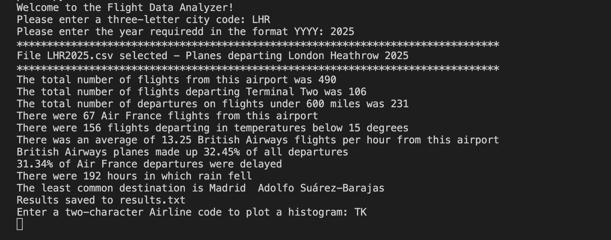

# 🛫 Flight Data Analyzer

A Python-based application that loads airport flight dataset files (CSV), analyzes flight statistics, and visualizes hourly airline activity using a custom graphical histogram (built with the **Zelle Graphics** library).

This program allows users to select an airport code and year, analyze flight departures, and display a histogram for any selected airline.

## 🚀 Features
### 🔍 Data Input & Validation

* User selects:

** Three-letter airport code (e.g., LHR, IST, FRA)

** Four-digit year (2000–2025)

* Validates input codes

* Loads matching `AIRPORTCODEYYYY.csv` file dynamically

### 📊 Statistical Analysis

The program calculates:

* Total number of departure flights

* Number of flights departing from **Terminal 2**

* Number of **short flights (<600 miles)**

* Total **Air France (AF)** flights

* Number of departures with **temperature < 15°C**

* Average **British Airways (BA)** flights per hour

* Percentage of BA departures

* Percentage of delayed Air France flights

* Number of **rainy hours**

* Least common destination(s)

Results are saved to `results.txt` automatically.

## 📈 Histogram Visualization

Users can enter an **airline code** (e.g., BA, AF, LH), and the program:

* Extracts scheduled departure hours (0–11)

* Counts the number of departures per hour

* Displays a histogram in a **GraphWin window**
(using `graphics.py` instead of matplotlib)

## 🛠️ Technologies Used

* **Python 3**

* **Zelle Graphics** (`graphics.py`) – custom GUI windows

* **CSV** – data processing

* **math, collections** – calculations

* **sys** – safe exit handling

No external plotting libraries (like matplotlib) are used.

## 📥 Installation

1. **Install Python 3.8+**

> [Python indir](https://www.python.org/downloads/).

2. **Download** `graphics.py`

Place this file in the same directory:

📌 Download link:

> [Graphics](https://mcsp.wartburg.edu/zelle/python/graphics.py).

3. **Clone the project**

>`git clone https://github.com/username/Flight-Data-Analyzer.git`

>`cd Flight-Data-Analyzer`

## ▶️ Running the Program

>`python cw_template.py`

The program will request:

1. Airport code

2. Year

3. Airline code (for histogram)

## 📂 Project Structure
```
Flight Data Analyzer
├─ cw_template.py              # Main program (your code)
├─ graphics.py                 # Zelle Graphics library
├─ LHR2025.csv                 # Example dataset (user-provided)
├─ CDG2021.csv                 # Example dataset (user-provided)
├─ results.txt                 # Auto-generated analysis output
└─ README.md                   # Project documentation
```

## 🔎 How It Works (Algorithm Overview)

1. **User selects** an airport code + year

2. Program loads the matching CSV file

3. Flight data rows are analyzed:

** Distance

** Weather

** Airline codes

** Delay times

** Destination frequencies

4. A dictionary of computed results is returned

5. Results print on screen and save to `results.txt`

6. User enters an **airline code**

7. Histogram window opens showing flights per hour

8. User may choose to analyze another dataset

## 📊 Sample Output (Terminal)


